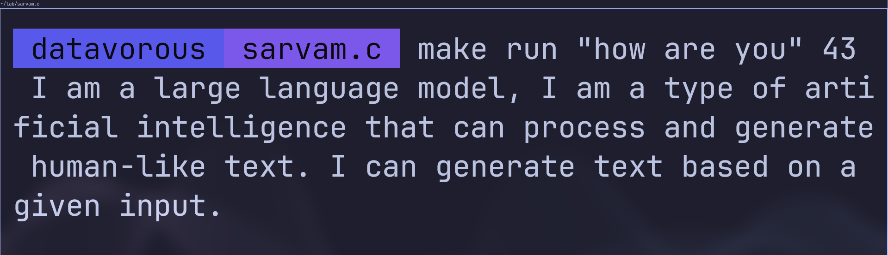

<p align="center">
  
</p>

<h2 align="center">sarvam.c</h2>

<p align="center">
  A model specialized CPU inference runtime for Sarvam-1 written in C
</p>

### Why?

The aim is to explore whether we can outperform `llama.cpp` by aggressively specializing for Sarvam-1's exact configuration. Sarvam-1 is the smallest Open-Weights model published by Sarvam.ai as of March, 2026.

### Demo



> [!NOTE]
> Indic texts don't render properly in my kitty terminal. I could not get it to work properly with fonts like Noto.

### Usage

Git clone, navigate and then:

```bash
# fetch model weights and export them to the binary blob format
make export
# compile main.c
make
# run
make run "your prompt" <number of tokens>
# optional benchmark harness (ttft + ms/token)
make benchmark-build
make benchmark "your prompt" <number of tokens>
```

### How?

The [architecture](https://huggingface.co/sarvamai/sarvam-1/blob/main/config.json) is identical to what I found in Karpathy's [llama2.c](https://github.com/karpathy/llama2.c) so forward pass required only two major architectural changes i.e. `RoPE` extracted into its own function applied separately to `Q` and `K`, precomputed `freq_cis` tables replaced with on-the-fly calculation.

The tokeniser was the messiest part. llama2.c assumed ASCII where as Sarvam-1 uses SentencePiece with a 68096-token vocabulary built for Indic scripts (UTF-8 multibyte characters(`▁` (U+2581) as the space marker, and `[INST]/[/INST]` chat template tokens). The encoder walks UTF-8 codepoints, substitutes spaces with `▁`, falls back to `<0xHH>` hex tokens for unknown bytes, then runs BPE merges, then the decoder maps `▁` back to spaces on output.

### Plans?

To be the fastest CPU only runtime for Sarvam-1 and prove it with numbers.

- [ ] Integrate OpenBLAS
- [ ] Fuse kernels
- [ ] Implement Q8 quantization

### References

1. [DeepWiki :: karpathy/llama2.c](https://deepwiki.com/karpathy/llama2.c/2-inference-engines)
2. [S Raschka :: Implementing a BPE from Scratch](https://sebastianraschka.com/blog/2025/bpe-from-scratch.html)

### Questions?

Email: sbcharjee.acad@gmail.com  
Discord: [Join the server](https://discord.gg/XPrAs44vdH)
